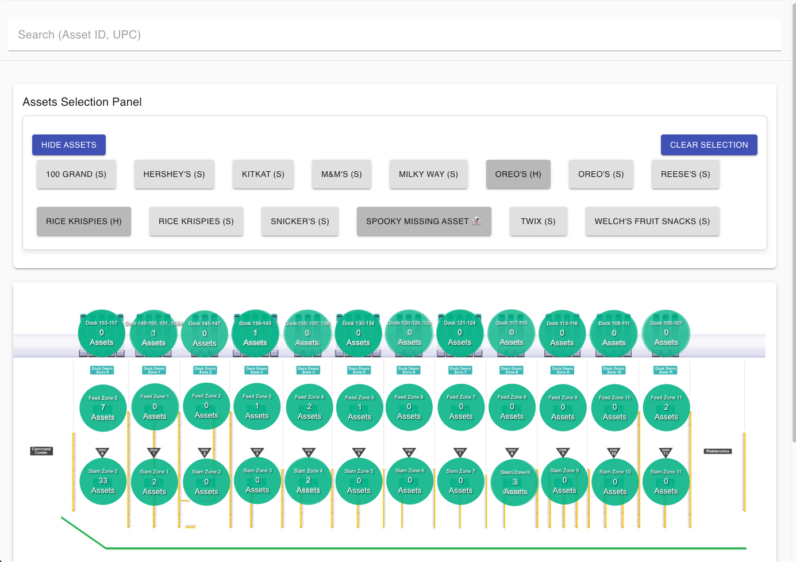
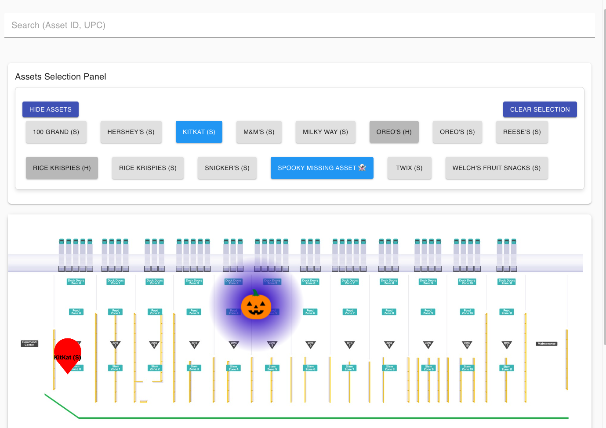
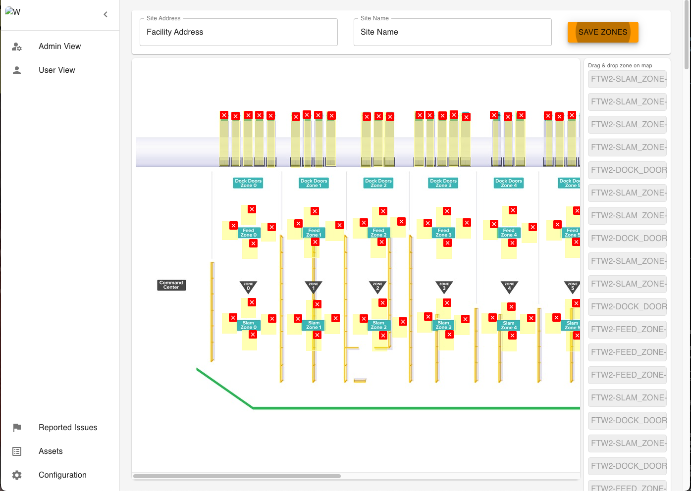

# wiliot-location-app
**Utilize Wiliot tags to find assets.**

## App Overview
**user-view**
The user-view is a way for users to view where their assets are. You can see the 'bubble' view, an overview of where your assets are in the facility. Also you can see the 'selected' or 'searched' view where specific assets are. Some assets are event located and others are heatmap located, showing heat where packets are received. Currently packets are an internal feature to Wiliot. These two location types have a tradeoff between speed, heatmap, and accuracy, event. Heatmap located assets are fast, but have lots of noise. Event located assets are slower, but have extremely high accuracy.





**admin-view**
The admin view is where the bridges are placed on a map. They are placed with a scalable SVG. The specific bridges receive pakets and will be used to render. packets will render on each bridge and events will render on the average location (XY) for the bridges in it's zone.




## Initializing the Project
To initialize you need to upload preliminary information into the database.

Here are the following tables and how they can be initialized:
**assets**: This doesn't need to be intialized. As information is received it will auto-populate. An example is found [here](readme-assets/document-db-examples/assets-example.json)
**bridge-mapping-details**: This collection needs to be initialized with the bridges that will be used in the UI. If packets aren't being used, you just need one of these to define a zone. Reference [this](readme-assets/document-db-examples/bridge-mapping-details-example.json) to see which fields are needed.
**locations**: This should be initialized in the document database with the following information found [here](readme-assets/document-db-examples/locations-example.json). It stores the location and id of the location from the Wiliot platform.
**tag-asset-mapping**: This is only needed for packet location. It acts as a key:value store for tagIds:assetIds. It translates packets that have a tagId to modify some asset with assetId. It can be found [here](readme-assets/document-db-examples/tag-asset-mapping-example.json)
**wavelet**: For wavelets for work for packet location this is needed. It manages state of which assets to track and the packets it has received. It should be instantiated with [this](readme-assets/document-db-examples/wavelet-example.json) 
**zone-mapping**: This collection contains extra information about the location. Importantly, it links a certain location with the imageURL that is displayed. It fetches this image and renders it on the UI.

> All timestamps with seconds and nanoseconds are from `new Date()` in JS.


## development

### react-app
1. go into react-app dirtory with `cd react-app`
2. run `yarn install` to install all the dependenceis
3. run `yarn run start` to start development server

### serverless-functions


These functions should be deployed in a serless function environemnt like AWS Lambda or GCP Cloud Functions. The functions directoty contains 4 functions. 2 for backend tasks and 2 for frontend UI management.

`eventHandler.js` processes incoming events from Kafka. Triggered by the Confluent Kafka connector for serverless functions. Confluent Kafka sends data directly with their connector in a non-traditional format. 
- {a=jfk, b=uio} compared to {a:"jfk",b:"uio"}
- 
`packetHandler.js` processes incoming packets from a messaging queue.

`manageWaveletPackets.js` manages which asset packets will be tracked and if any will be processes at all. It is triggered by changes on the wavelet collection.

`processSelectedAssetEvents.js` processes packets from a messaging queue. It will update the wavelet collection with new records. It is triggered by the messaging queue, but it conditionally processes messages fully based on the wavelet collection that is controlled by the manageWaveletPackets function.


### mqtt-forwarding
This service acts as an intermediary between the MQTT broker and the GCP PubSub channels that are used to process packet data for the location-app. 

Why use this over a stateless app? The main reason to use this over a stateless app is that the packet rates are being actively tracked with heartbeat signals to measure packet rate even if there are no packets.

**to use it**
```bash
yarn install
yarn start
```